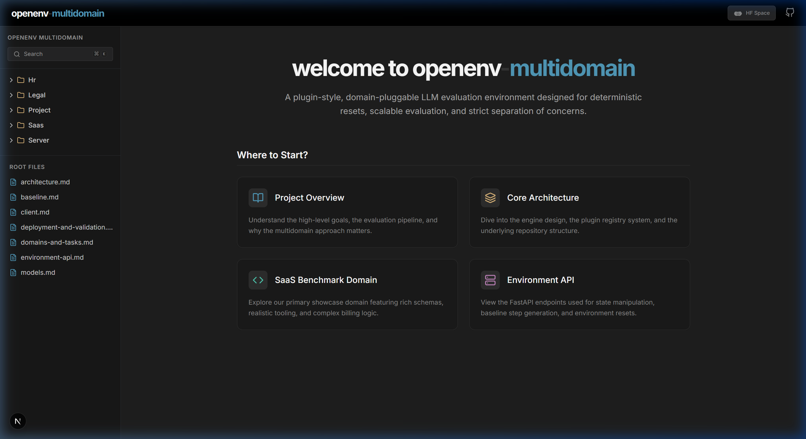

# openenv-multidomain-docs

The official documentation website for the **openenv-multidomain** project. Built with Next.js, Tailwind CSS, and React Markdown, this site provides a premium, IDE-inspired reading experience for engine developers.



## 🚀 Key Features

- **VS Code Inspired UI:** Sleek, high-contrast dark theme with a collapsible project explorer.
- **Global Search (Cmd + K):** Instant fuzzy search across all documentation files.
- **Dynamic Table of Contents:** Automatically extract headings and track scroll position.
- **Code Utilities:** One-click copy-to-clipboard for all code blocks and JSON snippets.
- **Bespoke Landing Page:** Interactive "Where to Start" navigation cards.

## 📂 Repository Structure

- `website/docs`: The source markdown files for the documentation.
- `website`: The Next.js 15 application that parses and renders the `/docs` content.

## 🛠️ Local Development

1. **Clone the repository:**
   ```bash
   git clone https://github.com/YohaanKhan/openenv-multidomain-docs.git
   cd openenv-multidomain-docs
   ```

2. **Install dependencies:**
   ```bash
   cd website
   npm install
   ```

3. **Run the development server:**
   ```bash
   npm run dev
   ```

4. **View the site:**
   Open [http://localhost:3000](http://localhost:3000) (or 3001) in your browser.

## 📄 License

This documentation is part of the OpenEnv Multidomain ecosystem. 
Designed and built for the OpenEnv project.
